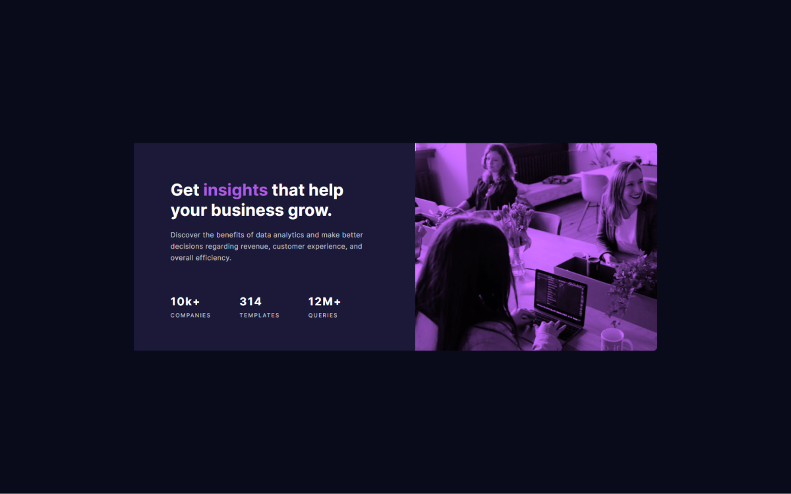

# Frontend Mentor - Stats preview card component solution

This is a solution to the [Stats preview card component challenge on Frontend Mentor](https://www.frontendmentor.io/challenges/
stats-preview-card-component-8JqbgoU62). Frontend Mentor challenges help you improve your coding skills by building realistic projects.  

## Table of contents

- [Frontend Mentor - Stats preview card component solution](#frontend-mentor---stats-preview-card-component-solution)
  - [Table of contents](#table-of-contents)
  - [Overview](#overview)
    - [The challenge](#the-challenge)
    - [Screenshot](#screenshot)
    - [Links](#links)
  - [My process](#my-process)
    - [Built with](#built-with)
    - [What I learned](#what-i-learned)
    - [Continued development](#continued-development)
  - [Author](#author)
  - [Acknowledgments](#acknowledgments)
## Overview

### The challenge

Users should be able to:

- View the optimal layout depending on their device's screen size
- See hover states for interactive elements

### Screenshot



### Links

- Solution URL: [Add solution URL here](https://github.com/KrzysztofGrudzien/frontend-mentor-stats-card-component)
- Live Site URL: [Add live site URL here](https://krzysztofgrudzien.github.io/frontend-mentor-stats-card-component/)

## My process

### Built with

- Semantic HTML5 markup
- CSS custom properties
- CSS Flexbox
- Mobile-first workflow
- BEM Methodology

### What I learned

In this project, I tried to repeat my knowledge about pure HTML and CSS. As an additional tip, I used CSS properties and BEM Methodology.

Few lines of code from the project:

```html
        <main class="main">
            <article class="card">
                <div class="card__img-background"></div>
                <div class="card__content">
                    <h1 class="card__title">
                        Get <span class="card__title--accent">insights</span> that help your business grow.
                    </h1>
                    <p class="card__description">
                        Discover the benefits of data analytics and make better decisions regarding revenue, customer
                        experience, and overall efficiency.
                    </p>
                    <div class="stats">
                        <div class="stats__companies">
                            <span class="text-big">10k+</span>
                            companies
                        </div>
                        <div class="stats__templates">
                            <span class="text-big">314</span>
                            templates
                        </div>
                        <div class="stats__queries">
                            <span class="text-big">12M+</span>
                            queries
                        </div>
                    </div>
                </div>
            </article>
        </main>
```
```css
ol,
ul {
    list-style: none;
}

img {
    max-width: 100%;
    height: auto;
}

p {
    font-size: 1.5rem;
}

.card {
    display: flex;
    flex-direction: column;
    margin: 0 2.4rem;
}

.card__img-background {
    background-image: url(../images/image-header-mobile.jpg);
    background-color: var(--color-secondary-accent);
    background-size: cover;
    background-blend-mode: multiply;
    border-top-left-radius: var(--radius-8);
    border-top-right-radius: var(--radius-8);
    filter: brightness(1.3);
    height: 240px;
    object-fit: cover;
    width: 100%;
}

```

### Continued development

## Author

- Website - [In progress]
- Frontend Mentor - [@KrzysztofGrudzien](https://www.frontendmentor.io/profile/KrzysztofGrudzien)
- E-mail - krzysztof.grudzien.fed@gmail.com

## Acknowledgments
